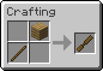

# Chisel

Lightweight utility mod that adds a new tool for builders

## Features
When you right-click a block with the Chisel, it instantly replaces that block with the one you’re holding in your off-hand

## Requirements
- Minecraft: 1.21+
- Fabric Loader: 0.17.2 or newer

## Contributing
Issues, pull requests and translations are welcome

## License
MIT (see LICENSE file)
